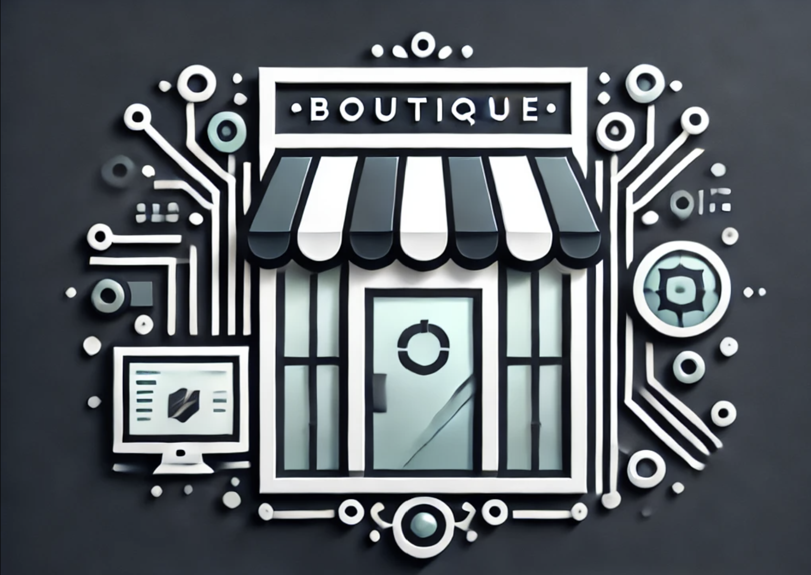

    

# Boutique - A modern internal developer portal

This project is currently in the initialisation phase and does not review nor accept merge requests.

## Getting Started

### Prerequisites

### Usage

## Roadmap

### 01 - Initialisation

- [x] Setup Local Development
- [x] Setup GitHooks
- [x] Setup Changelog
- [x] Setup Makefile
- [x] Setup Tests
- [ ] Define Architecture Principles
- [ ] Setup Architecture Tests
- [x] Define Domain
- [x] Define Basic Architecture
- [x] Setup README
- [x] Define Roadmap to MVP
- [x] Setup CI Pipeline

### 02 - MVP

- [ ] Setup Release Pipeline
- [ ] Setup Badges
- [ ] Define Roadmap to Plugin System
- [ ] Setup Codespaces

### 03 - Plugin System

### 05 - Stabilization

## Contributing

## Support

## Acknowledgements

Thanks for these awesome resources that were used during development:

- https://github.com/olivierlacan/keep-a-changelog
- https://github.com/conventional-commits/conventionalcommits.org
- https://c4model.com
- https://github.com/usebruno/bruno
- https://github.com/testcontainers/testcontainers-go
